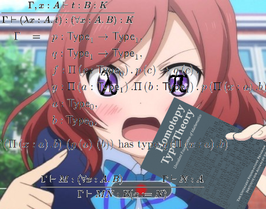

# Functional Programming in Scala3
Functional Programming in Scala book study in `Scala3`

## About
This repo is to 
1. record exercise and question solutions in various `FP` books;
2. record experiments using library `cats`, `cats-effect`, `shapeless`, `eff` ...;  
3. record experiments of my new ideas on function programming in `Scala3`;

## Books
1. Functional Programming in Scala
2. Scala with cats
3. Functional and Reactive Domain Modeling

## Principles of FP
1. First-class function
2. Type matters
3. Transparency
4. Immutable
5. Composition always matters
6. Abstract with data and typeclass
7. Utilize effects

To get things more interesting, I use `Scala3` to finish the repo.